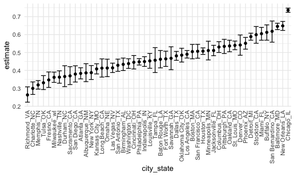

Homework 5
================
Ling Tuo
11/16/2020

-   [Problem 1](#problem-1)

This is my solution to HW5.

Problem 1
---------

Load the dataset.

This dataset contains 52179 rows and 12 columns.

The data contains the location of the killing, whether an arrest was
made, basic demographic information of each victim. There are victim
info variables – victim\_last, victim\_first, victim\_race, victim\_age
and victim\_sex, location variables – city, state, lat and lon, and case
info – uid, reported\_date and disposition.

Prop test for a single city – Baltimore.

    prop.test(
      aggregate_df %>% filter(city_state == "Baltimore_MD") %>% pull(hom_unsolved), 
      aggregate_df %>% filter(city_state == "Baltimore_MD") %>% pull(hom_total)) %>% 
      broom::tidy() %>% 
      select(estimate, conf.low, conf.high)

    ## # A tibble: 1 x 3
    ##   estimate conf.low conf.high
    ##      <dbl>    <dbl>     <dbl>
    ## 1    0.646    0.628     0.663

Iterate the prop test.

    results_df = 
      aggregate_df %>% 
      mutate(
        prop_tests = map2(.x = hom_unsolved, .y = hom_total, ~prop.test(x = .x, n = .y)),
        tidy_tests = map(.x = prop_tests, ~broom::tidy(.x))
      ) %>% 
      select(-prop_tests) %>% 
      unnest(tidy_tests) %>% 
      select(city_state, estimate, conf.low, conf.high)

Make a plot of the estimate proportions and CIs for each city.

    results_df %>%
      mutate(city_state = fct_reorder(city_state, estimate)) %>% 
      ggplot(aes(x = city_state, y = estimate)) +
      geom_point() +
      geom_errorbar(aes(ymin = conf.low, ymax = conf.high)) +
      theme(axis.text.x = element_text(angle = 90, vjust = 0.5, hjust = 1))

