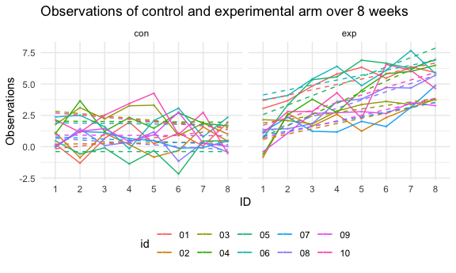

Homework 5
================
Ling Tuo
11/16/2020

-   [Problem 1](#problem-1)
-   [Problem 2](#problem-2)
-   [Problem 3](#problem-3)

This is my solution to HW5.

Problem 1
---------

Load the dataset.

This dataset contains 52179 rows and 12 columns.

The data contains the location of the killing, whether an arrest was
made, basic demographic information of each victim. There are victim
info variables – victim\_last, victim\_first, victim\_race, victim\_age
and victim\_sex, location variables – city, state, lat and lon, and case
info – uid, reported\_date and disposition.

Prop test for a single city – Baltimore.

    prop.test(
      aggregate_df %>% filter(city_state == "Baltimore_MD") %>% pull(hom_unsolved), 
      aggregate_df %>% filter(city_state == "Baltimore_MD") %>% pull(hom_total)) %>% 
      broom::tidy() %>% 
      select(estimate, conf.low, conf.high)

    ## # A tibble: 1 x 3
    ##   estimate conf.low conf.high
    ##      <dbl>    <dbl>     <dbl>
    ## 1    0.646    0.628     0.663

Iterate the prop test.

    results_df = 
      aggregate_df %>% 
      mutate(
        prop_tests = map2(.x = hom_unsolved, .y = hom_total, ~prop.test(x = .x, n = .y)),
        tidy_tests = map(.x = prop_tests, ~broom::tidy(.x))
      ) %>% 
      select(-prop_tests) %>% 
      unnest(tidy_tests) %>% 
      select(city_state, estimate, conf.low, conf.high)

Make a plot of the estimate proportions and CIs for each city.

    results_df %>%
      mutate(city_state = fct_reorder(city_state, estimate)) %>% 
      ggplot(aes(x = city_state, y = estimate)) +
      geom_point() +
      geom_errorbar(aes(ymin = conf.low, ymax = conf.high)) +
      theme(axis.text.x = element_text(angle = 90, vjust = 0.5, hjust = 1))

Problem 2
---------

Import datasets and add observations, id and group of each subjects as
variables.

    path_df = 
      tibble(
        path = list.files("data/p2_data"),
        id = substr(path, 1, 6)
        ) %>% 
      mutate(
        path = str_c("data/p2_data/", path),
        data = map(path, read_csv)
        ) %>% 
      unnest(data) %>% 
      separate(id, into = c("group", "id"), sep = "_" ) %>% 
      relocate(id, group)

Then, tidy the dataframe.

    tidy_df = 
      path_df %>% 
      select(-path) %>% 
      pivot_longer(week_1:week_8, names_to = "week", values_to = "observation") %>% 
      mutate(week = substr(week, 6, 6))

Make a spaghetti plot of observations on each subject over time. Since
the observations are difficult to track due to the large quantity, I add
linear smooths lines to help looking for trends.

    tidy_df %>% 
      group_by(id, group) %>% 
      ggplot(aes(x = week, y = observation, group = id, color = id)) + 
      geom_point(alpha = .3, size = 0.5) +
      geom_line() +
      geom_smooth(method = "lm", size = 0.5, se = FALSE, lty = 2) +
      labs(
      title = "Observations of control and experimental arm over 8 weeks",
      x = "ID",
      y = "Observations") +
      facet_grid(. ~ group) 

    ## `geom_smooth()` using formula 'y ~ x'

The observations of subjects fluctuate in both within the control and
experimental group, however, the general trend of experimental group is
increasing over time and control group has slightly decrease.

Problem 3
---------

    set.seed(1)

For *μ* = 0, generate 5000 datasets from the model *X* ∼ *N*(0, 5) with
sample size of 30.

    sim_mean_sd = function(samp_size = 30, mu, sigma = 5) {
      
      sim_data = 
        tibble(
          x = rnorm(n = samp_size, mean = mu, sd = sigma)
        )
      
      t_test = 
        t.test(sim_data$x, mu=0 ,conf.level = 0.95) %>% 
        broom::tidy() %>% 
        select(estimate, p.value)
      
      return(t_test)
      
    }

    sim_result = 
      rerun(5000, sim_mean_sd(mu = 0)) %>% 
      bind_rows()

Repeat t-test for *μ* = 1, 2, 3, 4, 5, 6

    sim_results = 
      tibble(
        mu_list = c(0, 1, 2, 3, 4, 5, 6)
        ) %>% 
      mutate(
        output_lists = map(.x = mu_list, ~ rerun(5000, sim_mean_sd(mu = .x))),
        estimate_df = map(output_lists, bind_rows)
        ) %>% 
      select(-output_lists) %>% 
      unnest(estimate_df) %>% 
      group_by(mu_list)

Now, make a plot of the proportion of times the null was rejected and
the true value of *μ*.

    plot_prop = 
      sim_results  %>% 
      filter(p.value < 0.05) %>% 
      count(mu_list) %>% 
      mutate(prop_rej = n/5000) %>% 
      ggplot(aes(x = mu_list, y = prop_rej)) + 
      geom_point(alpha = .5) +
      geom_line(alpha = .5) +
      labs(
        title = "Association between effect size(mu) and power of the t-test(proportion of rejection)",
        x = "True mean/mu",
        y = "Proportion of times the null was rejected")

    plot_prop

With the true mean increases, the proportion of times the null
hypothesis was rejected increases as well, i.e. the power of the test is
positively associated with the effect size. Besides, when the difference
between true mean and null is large enough, the growth rate of
proportion(power) slowed down and get closer to 1.

Then, make a plot showing the average estimate and the true mean, and a
overlaid plot showing the average estimate and the true mean in samples
for which the null was rejected.

    result_adjust = 
      sim_results %>% 
      mutate(
        mu_list = str_c("mu = ", mu_list),
        mu_list = fct_inorder(mu_list))

    result_rej =
      result_adjust %>% 
      filter(p.value < 0.05) %>% 
      mutate(avg_est = mean(estimate))

    plot_est_true =
      result_adjust %>% 
      mutate(avg_est = mean(estimate)) %>% 
      ggplot() + 
      geom_violin(aes(x = mu_list, y = estimate, fill = mu_list, alpha = 0.5)) +
      geom_point(aes(x = mu_list, y = avg_est, color = mu_list, alpha = 0.8)) +
      geom_abline(slope = 1, intercept = -1, lty = 2, alpha = 0.4) + 
      labs(
        title = "Association between estimates and true mean(for overall and rejected samples)",
        x = "True mean/mu",
        y = "Estimates/mu_hat",
        caption = "Violins without filling color and black points are values of rejected samples") +
      theme(legend.position = 'none') +
      geom_violin(data = result_rej, aes(x = mu_list, y = estimate, alpha = 0.5)) +
      geom_point(data = result_rej, aes(x = mu_list, y = avg_est, alpha = 0.3))

    plot_est_true

According to the plots, the sample averages of *μ̂* (showned as points in
the plot)across tests for which the null is rejected are not all
approximately equal to the true value of *μ*. When *μ* = 4, 5, 6, the
average estimate mean is far away from the true mean and almost 100%
tests are rejected, therefore, the sample for which the null is rejected
is approximately equal to the overall sample.

However, when *μ* = 1, 2, 3, part of null are rejected which influence
the sample average of estimates after filtering the samples. Since
samples that are not rejected(estimates are close to the null) are
discarded, the average estimates of remaining parts will be farther from
true mean if the proportion of rejection is larger. Particularly, when
*μ* = 0, there are almost no rejection, i.e. there should be no value
left around the true mean(0), but the average estimates is near 0 due to
symmetry.
